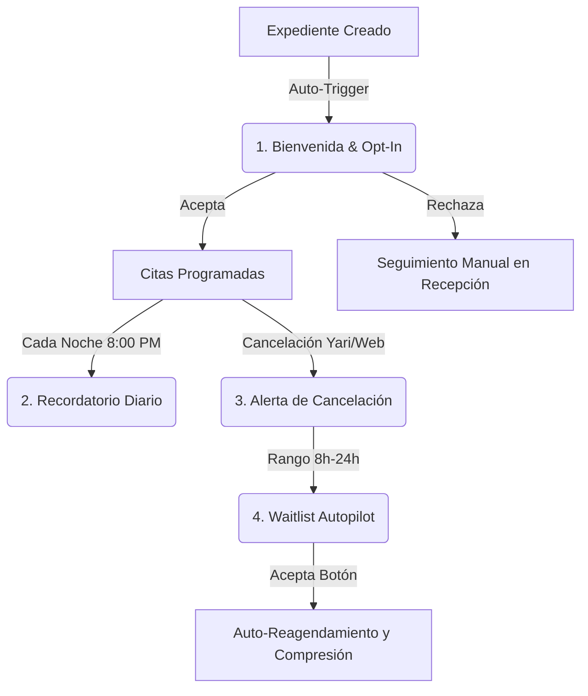

# 📖 Manual de Usuario: Ecosistema de Plantillas de WhatsApp (Parláre V2)

Este manual documenta de forma exhaustiva las plantillas aprobadas de **Twilio WhatsApp (Meta)** integradas en Parláre V2. Detalla su propósito clínico/operativo, cómo se disparan, qué variables dinámicas inyectan y el comportamiento automatizado de sus botones interactivos.

---

## 🗺️ Mapa General del Ecosistema de Plantillas

---

## 1. Plantilla: Bienvenida & Consentimiento (Opt-In)

| Detalle | Especificación |
| :--- | :--- |
| **Nombre del Template** | `bienvenida_con_optin` |
| **Content SID** | `HX08f74d9b520b85acfbf9e678e434b1f6` |
| **Propósito** | Formalizar el consentimiento de envío de recordatorios automáticos (Opt-In / Petición de Meta). |
| **Disparador (Trigger)** | Automático, al registrar un nuevo paciente en la ficha clínica de Parláre (`patientProfiles`). |

### 📝 Estructura del Mensaje
> *¡Hola {{1}}! Te damos la bienvenida a Parláre. 🌟 Nos entusiasma acompañarte en tu proceso. Para brindarte un mejor servicio, enviamos recordatorios automáticos por WhatsApp. ¿Nos autorizas a escribirte por esta vía?*
> 
> * **Botón 1 (Aceptar):** `"Sí, autorizo"` *(Payload: `optin_yes`)*
> * **Botón 2 (Rechazar):** `"No, prefiero manual"` *(Payload: `optin_no`)*

### ⚙️ Funcionamiento Interno & Flujo:
1. **Inyección de Variable:** `{{1}}` se inyecta con el **primer nombre del papá/mamá** (o del paciente) obtenido del formulario de registro.
2. **Registro de Estado:** En Firestore, el perfil del paciente se inicializa con `recurrentOptIn: "pending"`.
3. **Respuesta Interactiva:**
   * **Si presiona "Sí, autorizo":** El webhook actualiza el perfil a `recurrentOptIn: "accepted"`. El sistema queda autorizado para enviarle recordatorios diarios automáticos. El bot responde: *"¡Gracias! ✅ Activaste los recordatorios de WhatsApp de Parláre. Te escribiremos solo para confirmar tus citas."*
   * **Si presiona "No, prefiero manual":** El webhook actualiza el perfil a `recurrentOptIn: "rejected"`. El cronjob diario omitirá este número automáticamente. Además, **crea una alerta en tiempo real en la colección de recepción (`/reception_alerts`)** para que Yari gestione manualmente el caso. El bot responde: *"Entendido. No te enviaremos recordatorios automáticos..."*

---

## 2. Plantilla: Cancelación de Sesión (Seguridad y Privacidad)

| Detalle | Especificación |
| :--- | :--- |
| **Nombre del Template** | `cancelacion_sesion` |
| **Content SID** | `HX7493af9c40a5df17d33ca598f043f2ba` |
| **Propósito** | Notificar la cancelación de una sesión de forma inmediata, segura y totalmente anónima. |
| **Disparador (Trigger)** | Manual por Yari (al presionar "Cancelar" en la cita) o automático por el webhook cuando el paciente cancela respondiendo con la palabra clave `"cancelar"` o `"2"`. |

### 📝 Estructura del Mensaje
> *Hola, te informamos de Recepción que la sesión del {{1}} a las {{2}} con la terapeuta {{3}} ha sido cancelada. Si deseas reagendar o tienes dudas, puedes escribirnos directamente a nuestro chat de Recepción aquí: https://wa.me/523315196702*

### ⚙️ Funcionamiento Interno & Flujo:
1. **Inyección de Variables:**
   * `{{1}}` = Fecha de la cita en formato premium de lenguaje humano (ej: *"Lunes 18 de Mayo"*).
   * `{{2}}` = Hora de la cita en formato local de 12 horas (ej: *"4:00 PM"*).
   * `{{3}}` = Nombre de la terapeuta con su tratamiento formal (ej: *"Diana López"*, *"Sam"*, *"Vero"*).
2. **🔐 Protocolo de Privacidad:** De acuerdo con la **Regla de Oro de Seguridad de Parláre**, esta plantilla **NO contiene variables con nombres de pacientes ni de tutores**. Si un celular ajeno lee la notificación en la pantalla de bloqueo, la sesión se mantiene 100% anónima.
3. **Acción Posterior:** El mensaje incluye un enlace directo a la Recepción Humana (`https://wa.me/523315196702`) para iniciar el reagendamiento del espacio.

---

## 3. Plantilla: Recordatorio Diario (Confirmación 8:00 PM)

| Detalle | Especificación |
| :--- | :--- |
| **Nombre del Template** | `recordatorio_con_botones2` |
| **Content SID** | `HXe500a927cfbef3321fc0ba7ae7aa86d7` |
| **Propósito** | Validar la asistencia del paciente el día siguiente para optimizar la ocupación clínica. |
| **Disparador (Trigger)** | Cronjob automático que corre en el servidor de Render todos los días a las **8:00 PM** (Hora CDMX). |

### 📝 Estructura del Mensaje
> *Hola, te recordamos tu sesión de mañana {{1}} a las {{2}}. Confirma tu asistencia respondiendo a este mensaje:*
> 
> * **Botón 1 (Confirmar):** `"1 - Confirmar"` *(Payload: `1`)*
> * **Botón 2 (Cancelar):** `"2 - Cancelar"` *(Payload: `2`)*
> * **Botón 3 (Recepción):** `"3 - Yari"` *(Payload: `3`)*

### ⚙️ Funcionamiento Interno & Flujo:
1. **Inyección de Variables:**
   * `{{1}}` = Día de la cita (ej: *"Martes 19 de Mayo"*).
   * `{{2}}` = Hora de la cita (ej: *"5:30 PM"*).
2. **Filtro de Seguridad:** El cronjob consulta Firestore antes de disparar. Solo envía el mensaje si:
   * El paciente tiene `recurrentOptIn: "accepted"`.
   * La cita no está cancelada (`isCancelled: false`).
   * La cita no ha sido confirmada previamente (`confirmed: false`).
3. **Procesamiento de Respuestas:**
   * **Opción "1" (Confirmar):** El webhook de Parláre recibe la respuesta, marca la cita en Firestore como `confirmed: true`, actualiza la celda a color verde ("CONFIRMADO") en Google Sheets y en Google Calendar añade un `✅` en el título. Envía respuesta automática: *"¡Gracias! Se han confirmado las citas. ¡Nos vemos!"*
   * **Opción "2" (Cancelar):** El webhook marca la cita en Firestore como `isCancelled: true`, actualiza en Google Sheets y Google Calendar a color gris/cancelado y notifica en vivo a Yari. Envía respuesta automática: *"Cita cancelada. ¡Esperamos todo esté bien! 😊 Para reagendar... envía tu justificante médico a Yari aquí: https://wa.me/523315196702"*
   * **Opción "3" (Yari / Duda):** Responde con el enlace directo al chat personal de Yari para atención humana.

---

## 4. Plantilla: Optimizador de Espacios (Waitlist Autopilot)

| Detalle | Especificación |
| :--- | :--- |
| **Nombre del Template** | `oferta_adelanto_cita` |
| **Content SID** | `HX14731670198becbf2becfc20dbccb9b9` |
| **Propósito** | Ofrecer de forma automática espacios liberados de última hora para comprimir y optimizar la agenda de las terapeutas. |
| **Disparador (Trigger)** | Automático (Cloud Function `on_appointment_cancelled_trigger`). Se dispara cuando una cita es cancelada dentro de una ventana de **8 a 24 horas antes** de la sesión. |

### 📝 Estructura del Mensaje
> *Hola, te saludamos de Recepción de Parláre. Se ha liberado un espacio el día de hoy a las {{1}} con la terapeuta {{2}}. Como tienes activada nuestra lista de espera inteligente, ¿te gustaría adelantar tu sesión a este horario?*
> 
> * **Botón 1 (Aceptar):** `"Sí, adelantar"` *(Payload: `offer_yes`)*
> * **Botón 2 (Declinar):** `"No, gracias"` *(Payload: `offer_no`)*

### ⚙️ Funcionamiento Interno & Flujo:
1. **Búsqueda y Segmentación:** Al ocurrir la cancelación, la Cloud Function escanea la base de datos buscando pacientes que tengan cita **ese mismo día, pero programadas más tarde** con la **misma terapeuta**, y cuyo perfil tenga `recurrentOptIn: "accepted"`.
2. **Envío Selectivo:** El sistema envía de forma paralela la oferta a los candidatos ordenados de atrás hacia adelante (para liberar primero las últimas horas del día).
3. **El Primero en Responder Gana (Race Condition):**
   * **Caso Éxito (Primer Aceptante):** Al presionar **"Sí, adelantar"**, el webhook verifica que el slot siga cancelado en Firestore. Si lo está, reprograma su cita al nuevo horario de forma inmediata, actualiza Google Calendar y Google Sheets, cancela sus ofertas pasadas y envía confirmación: *"¡Excelente! Tu sesión ha sido reprogramada con éxito para el día de hoy a las [Nueva Hora]. ¡Te esperamos! 😊"*. Crea una alerta `autopilot_compress` en tiempo real para que Yari vea que el espacio se llenó solo.
   * **Caso Agotado (Respuestas Posteriores):** Si un segundo paciente presiona el botón, el bot le responde de forma clara y amable: *"Lo sentimos, ese horario ya fue tomado por otro paciente. Tu cita se mantiene en su horario original."*
   * **Caso Declinado:** Si presiona **"No, gracias"**, el bot marca su oferta individual como `"declined"` para control interno, mantiene su horario intacto y le responde: *"Entendido. No te preocupes, tu sesión se mantiene programada en tu horario habitual..."*

---

## 🔍 Resumen Operativo para Recepción (Yari)

*   **¿Dónde veo si un paciente aceptó recordatorios?**
    En la tarjeta del paciente en el Sidebar de Parláre, se lee el campo `recurrentOptIn` (Aceptado, Pendiente, Rechazado).
*   **¿Qué pasa si un paciente cambia de opinión?**
    Yari puede editar manualmente el interruptor de WhatsApp en la ficha clínica del paciente. El backend leerá la nueva configuración en la siguiente consulta de base de datos.
*   **¿Cuándo sé que actuó el Autopilot?**
    En la sección de alertas de Recepción, se notificará inmediatamente con un registro que Yari puede auditar y marcar como resuelto.
