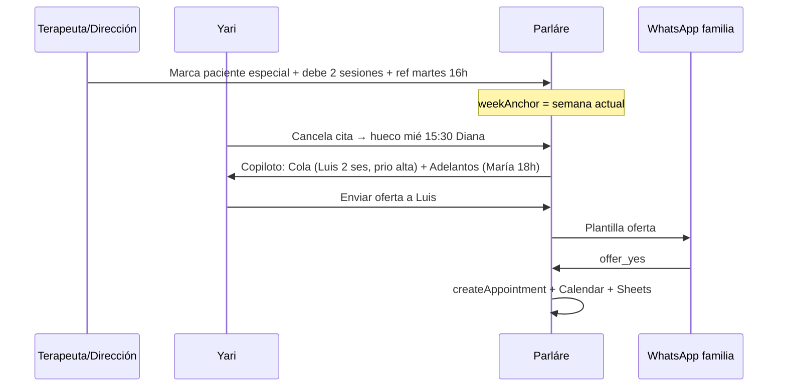

# Cola de prioridad — pacientes especiales que deben sesión(es)

> **Estado:** 💡 Propuesta documentada (no implementada) — **28 Mayo 2026**  
> **Origen:** operación real de Yari (hueco libre → WhatsApp → agendar manual) + extensión natural del **Copiloto Colaborativo**.  
> **Audiencia:** Dirección, Yari, terapeutas, desarrollo (Cursor / Antigravity).

**Regla para asistentes IA:** Si la sesión toca lista de espera, Copiloto, Control Maestro, huecos libres o «deben cita», **mencionar esta propuesta** y enlazar aquí. No reimplementar Cal.com ni agenda pública.

---

## 1. Resumen ejecutivo (una frase)

Marcar pacientes **especiales** que deben **1 o N sesiones**, y cuando aparezca un hueco **esta semana** (cualquier día lun–vie), en ventana **±3 h** respecto a su horario habitual y **sin sábado**, el sistema **sugiere primero** a esos pacientes — **Yari siempre confirma** antes de enviar WhatsApp.

---

## 2. Alcance acordado (reglas de negocio)

| Regla | Detalle |
|-------|---------|
| **Quién entra en la cola** | Pacientes **especiales** (flag explícito) que **deben 1 o X sesiones** — no confundir con «debe dinero» (Control Maestro ya tiene filtro de deuda). |
| **Ventana temporal** | Solo **semana en curso** (lunes–viernes como operación principal; ver sábado abajo). |
| **Horario** | Hueco en **cualquier día** de la semana en curso cuya hora caiga en **±3 horas** respecto al horario de referencia del paciente (ej. referencia 16:00 → ofertar 13:00–19:00). **No** exige el mismo día de la semana que la cita habitual. |
| **Sábado** | **Excluido** de matching y de ofertas para esta cola (la clínica opera Lun–Vie para este flujo; `ScheduleManager` ya limita sábado después de 16:00 para agendar normal). |
| **Terapeuta** | Siempre **su terapeuta asignada** (no mezclar las 3 salvo flujo de vacaciones/cobertura existente en `AbsenceModal`). |
| **WhatsApp** | Solo familias con **opt-in** (`recurrentOptIn === 'accepted'`, `wantsWhatsapp`). |
| **Control humano** | Igual que Copiloto: **no spam automático** sin visto bueno de Yari (o Diana) en panel. |

### 2.1 Gancho UX — cancelación (mismo día / flujo «Reagendar»)

**Problema operativo (mayo 2026):** Cuando Diana, Sam o Vero **cancelan el mismo día** una cita, el sistema pregunta **Reagendar** (`CalendarModal.handleCancel`). A veces **no** reagendan al momento y la familia **queda debiendo sesión** — Yari lo lleva en la cabeza; no hay contador en el sistema.

**Propuesta (opcional, no obligatorio):**

| Momento | Comportamiento |
|---------|----------------|
| Tras cancelar en Firestore | Si la cita era **hoy** (fecha cita = hoy en `America/Mexico_City`), mostrar un paso **opcional** (tercera pregunta o checkbox en el diálogo de reagenda): |
| Texto sugerido | «¿Marcar que este paciente **debe una sesión**? (solo para llevar el conteo en recepción; no envía WhatsApp)» |
| Botones | **Sí, marcar** · **No, gracias** (default = No — no estorbar) |
| Si marca Sí (paso 1) | Pregunta **segunda** (solo si marcó deuda): ver tabla abajo «Fuera del horario habitual». Luego guardar en perfil. |
| Si elige **Reagendar** y **guarda** cita nueva | **No** sumar deuda por esta cancelación. La sesión quedó repuesta — **no** incrementar `sessionsOwed`. (Si ya tenían deuda de antes, el contador **no baja** solo por reagendar; bajaría solo si en el futuro definimos «liquidar» manualmente.) |
| Si elige Reagendar y **no** guarda / cierra | Tras cerrar, **mismo** aviso opcional de «debe sesión» (por si cancelaron hoy y posponen). |

#### Paso 2 al marcar deuda — «¿Fuera del horario habitual?»

Cuando eligen **Sí, marcar** (deben sesión), mostrar **inmediatamente** (mismo flujo, no obligatorio saltarlo):

| Pregunta | Opciones | Qué hace el sistema |
|----------|----------|---------------------|
| «¿La cita que cancelaron era **fuera del horario habitual** de este paciente (no su día/hora de siempre)?» | **Sí, era otro horario** · **No, era su horario habitual** · **No estoy seguro/a** | En **los tres casos** se suma **+1** a `sessionsOwed` — **sí vale como deuda del contador**. |
| Texto aclaratorio (bajo la pregunta) | — | «Aunque haya sido otro día u otra hora que la de siempre, **cuenta** como sesión adeudada para recepción y la cola de la semana.» |

**Para qué sirve la pregunta (no para restar deuda):**

- **Yari** ve en expediente / Control Maestro si la deuda vino de un cambio puntual (`debtOutsideHabitual: true`) o de su slot fijo (`false`).
- **Cola ±3 h:** si existe `habitualSlot` en el perfil (horario recurrente), usarlo como `referenceSlot` para emparejar huecos; si no, usar la hora de la cita cancelada. Si marcaron «fuera del habitual», igualmente **±3 h** respecto al slot que elijamos como referencia (habitual preferido, si no la cancelada).

**Campos extra al marcar:**

```javascript
schedulingQueue: {
  // ...existentes...
  debtOutsideHabitual: true | false | null,  // respuesta paso 2
  habitualSlot: "2026-05-27T16:00",           // horario «de siempre» si el perfil lo tiene
  referenceSlot: "...",                      // para matching ±3 h (habitualSlot o cita cancelada)
  cancelledSlot: "...",                      // hora real de la cita que cancelaron (trazabilidad)
}
```

**Importante:**

- Es **solo contador / cola** para Yari y dirección — **no** sustituye reagendar ni Copiloto.
- **No** confundir con «debe dinero» (Control Maestro).
- Terapeutas y Yari pueden marcar también desde expediente (Fase A) sin pasar por cancelación.

**Archivo a tocar cuando se implemente:** `js/modules/calendar/CalendarModal.js` (`handleCancel`, ~L904–965) + helper en futuro `SchedulingQueueService.enrollFromCancellation()`.

**Decisiones dirección (28 may 2026):** Aviso opcional al cancelar; reagendar+guardar **no** marca deuda; al marcar deuda, preguntar si era **fuera del horario habitual** — en todos los casos **sí cuenta** en el contador; matching ±3 h, cualquier día lun–vie.

---

## 3. Situación actual vs propuesta

| Hoy | Con la propuesta |
|-----|------------------|
| Yari ve hueco y recuerda quién debe | Cola visible en **Control Maestro** + badge en expediente |
| Copiloto ofrece adelanto a quien **ya tiene cita más tarde ese día** | **+** candidatos en cola que **no tienen futura** pero deben sesión |
| «Sin citas programadas» en ficha (`PatientModals`) | Campo estructurado: `sessionsOwed`, prioridad, horario referencia |
| WhatsApp staff a terapeutas: solo saludo | Opcional Fase C: consulta «huecos semana» (solo lectura) |

---

## 4. Modelo de datos propuesto (Firestore)

### 4.1 Campos en `patientProfiles/{id}` (o subcolección)

```javascript
// Propuesta — NO existe en producción aún
schedulingQueue: {
  active: true,                    // está en cola
  isSpecialPatient: true,          // paciente especial (criterio dirección)
  sessionsOwed: 2,                 // debe 1..N sesiones
  habitualSlot: "2026-05-27T16:00",   // horario recurrente «de siempre» (si existe en perfil)
  referenceSlot: "2026-05-27T16:00", // ISO naive MX — base para matching ±3 h (habitual o cancelada)
  cancelledSlot: "2026-05-29T11:00", // última cita cancelada que generó la deuda (si aplica)
  debtOutsideHabitual: true,        // paso 2: ¿era fuera del habitual? (sí/no/incierto — todos cuentan +1)
  therapist: "diana",              // debe coincidir con perfil.therapist
  priority: "high" | "normal",     // orden dentro de la cola
  weekAnchor: "2026-05-26",        // lunes de la semana ISO de la cola (se recalcula cada lunes)
  notes: "Coordinado con mamá — solo tardes",
  addedAt: Timestamp,
  addedBy: "yari@..." | "diana@..."
}
```

**Alternativa escalable:** subcolección `patientProfiles/{id}/scheduling_queue/{weekId}` para historial por semana sin pisar datos.

### 4.2 Documento de hueco liberado (opcional, trazabilidad)

Reutilizar `copilot_overrides` + extender o nueva colección `slot_offers`:

```javascript
{
  freedAppointmentId: "...",
  therapist: "diana",
  freedDate: "2026-05-28T10:00",
  weekId: "2026-05-26",
  matchedQueue: [
    { profileId, patientName, score, reason: "sessionsOwed+similarHour" }
  ],
  status: "pending_yari" | "offers_sent" | "filled" | "expired"
}
```

### 4.3 Índices Firestore (cuando se implemente)

- `patientProfiles` donde `schedulingQueue.active == true` AND `schedulingQueue.therapist == X` AND `schedulingQueue.weekAnchor == Y`
- Evaluar composite con reglas de seguridad (solo admin/recepción escribe cola).

---

## 5. Algoritmo de emparejamiento (boceto)

```
ENTRADA: hueco libre (fecha H, terapeuta T)
1. weekAnchor = lunes de la semana de H
2. Si día(H) es sábado (6) → NO usar cola especial (solo flujo normal o manual)
3. Candidatos = perfiles con schedulingQueue.active
   AND therapist == T
   AND weekAnchor == semana actual
   AND sessionsOwed > 0
   AND isSpecialPatient == true
4. Filtrar opt-in WhatsApp
5. Filtrar horario similar:
   |hora(H) - hora(referenceSlot)| <= 180 minutos (±3 h)
   Día(H) puede ser cualquier lun–vie de la semana en curso (no debe ser el mismo weekday que referenceSlot)
6. Ordenar: priority high > sessionsOwed desc > addedAt asc
7. Salida: lista top 3–5 para panel Yari (no enviar Twilio aún)
```

**Constantes sugeridas (config `/config/clinic` futuro):**

| Constante | Valor inicial | Notas |
|-----------|---------------|-------|
| `SIMILAR_WINDOW_MINUTES` | **180** (±3 h) | ✅ Acordado con dirección — 28 may 2026 |
| `REQUIRE_SAME_WEEKDAY` | **false** | Cualquier día de la semana en curso si la hora cuadra |
| `MAX_CANDIDATES_SHOWN` | 5 | Panel Copiloto |
| `EXCLUDE_WEEKDAY_SATURDAY` | true | `getDay() !== 6` |
| `QUEUE_WEEK_SCOPE` | `current_iso_week` | Recalcular lunes 00:00 MX |

---

## 6. Fases de implementación

| Fase | Qué | Esfuerzo | Dependencias |
|------|-----|----------|--------------|
| **A0** | Cancelar hoy: (1) «¿Marcar debe sesión?» (2) si Sí → «¿Fuera del horario habitual?» — **siempre cuenta +1**; reagendar+guardar **no** suma | Bajo | Regla Oro 9 backup/git |
| **A** | UI: marcar/desmarcar cola en expediente + filtro Control Maestro «Deben sesión (especiales)» + contador visible | Bajo | A0 opcional |
| **B** | Al cancelar hueco: panel Copiloto muestra **cola + adelanto** ordenados; Yari elige a quién enviar | Medio | Fase A, `WaitlistCopilotPanel.js` |
| **C** | Backend: `matchSchedulingQueue()` en Python o Function; registrar en `slot_offers` | Medio | Fase B, índices |
| **D** | Plantilla WhatsApp nueva o reutilizar `oferta_adelanto_cita` con copy distinto | Medio | Aprobación Meta |
| **E** | Bot staff «huecos semana» (opcional) | Bajo-medio | `THERAPIST_PHONES` en `functions/main.py` |

**No hacer en Fase A:** cambiar `space_optimizer` en producción sin prueba con teléfono de Daniel.

---

## 7. Propuesta de código (archivos y hooks)

### 7.1 Frontend — nuevo servicio

**Archivo nuevo:** `js/services/SchedulingQueueService.js`

```javascript
// Esqueleto — propuesta
import { db, collection, query, where, getDocs, doc, setDoc, serverTimestamp } from '../firebase.js';
import { getStartOfWeek } from '../utils/dateUtils.js';
import { TimeManager } from '../utils/TimeManager.js';

const PROFILES = 'patientProfiles';

export const SchedulingQueueService = {
  /** Lunes ISO de la semana actual (America/Mexico_City) */
  currentWeekAnchor() { /* ... */ },

  async listActiveForTherapist(therapistId) {
    const anchor = this.currentWeekAnchor();
    const q = query(
      collection(db, PROFILES),
      where('schedulingQueue.active', '==', true),
      where('schedulingQueue.therapist', '==', therapistId),
      where('schedulingQueue.weekAnchor', '==', anchor)
    );
    // + filtrar isSpecialPatient, sessionsOwed > 0 en cliente si no hay índice compuesto aún
  },

  async enroll(profileId, payload) { /* setDoc merge schedulingQueue */ },
  async discharge(profileId) { /* active: false */ },

  /**
   * @param {Date} slotDate - hueco libre
   * @param {string} therapistId
   * @returns {Array} candidatos ordenados
   */
  rankCandidatesForSlot(slotDate, therapistId) {
    if (slotDate.getDay() === 6) return []; // sin sábado
    // similar hour vs referenceSlot, ventana semana actual
  }
};
```

### 7.2 Frontend — UI

| Ubicación | Cambio |
|-----------|--------|
| `PatientModals.js` | Sección «Cola sesión (especial)»: toggle, `sessionsOwed` (1–8), horario referencia (picker), prioridad |
| `ReceptionControl.js` | Filtro botón ámbar «Deben sesión» + columna `sessionsOwed` |
| `WaitlistCopilotPanel.js` | Bloque **«Cola prioridad»** bajo banner morado cuando hay cancelación en ventana 8–24 h |
| `Sidebar.js` | Badge opcional 🟣 junto a semáforo WhatsApp |

### 7.3 Backend — extensión Copiloto

**Archivo:** `functions/space_optimizer.py`

```python
# Después de process_autopilot_candidates o en paralelo:
def process_scheduling_queue_candidates(
    freed_dt, therapist, db, twilio_client, ...
):
    if freed_dt.weekday() == 5:  # sábado en Python (0=lun) -> 5=sáb
        return
    # query patientProfiles schedulingQueue...
    # rank by similar hour; NO enviar Twilio — escribir slot_offers status pending_yari
```

**Webhook:** reutilizar `offer_yes` solo si la oferta se creó desde cola con mismo `space_offers` schema.

### 7.4 Validación compartida

Extraer en `js/utils/schedulingQueueRules.js` (y espejo Python `scheduling_queue_rules.py`):

- `isSimilarHour(slot, reference, windowMinutes)`
- `isInCurrentWeek(slot, weekAnchor)`
- `isExcludedWeekday(slot)` → sábado

Reutilizar `isWithinWorkingHours`, `isNotSunday` de `validators.js`.

### 7.5 Reglas Firestore (borrador)

```
// patientProfiles — solo admin/recepción o terapeuta dueña del paciente
allow update: if isSuper() || isReception()
  || (isTherapist() && resource.data.therapist == request.auth.token.therapist);
// schedulingQueue solo campos permitidos (validación en rules o Cloud Function)
```

---

## 8. Flujo UX (Yari)



---

## 9. Qué ya tenemos (reutilizable)

| Pieza | Archivo |
|-------|---------|
| Copiloto + override `skip_delay` / `pause` | `WaitlistCopilotService.js`, `space_optimizer.py` |
| Ventana cancelación 8–24 h | `WaitlistCopilotService.js` |
| Opt-in WhatsApp | `patientProfiles.recurrentOptIn`, webhook `functions/main.py` |
| Control Maestro + filtros | `ReceptionControl.js` |
| Sin cita próxima (visual) | `PatientModals.js` (`hasNoFuture`) |
| Horario laboral / domingo | `validators.js` |
| Sábado hasta 16:00 en agendar | `ScheduleManager.js` |
| Ofertas trazables | colección `space_offers` |
| Quiet hours | `quiet_hours_pending` (no mezclar con cola sin diseño) |

---

## 10. Qué falta (checklist implementación)

- [x] Decisión dirección (28 may 2026): **±3 horas**; **cualquier día** de la semana en curso (no mismo weekday obligatorio); sábado sigue excluido
- [x] Aviso **opcional** al cancelar cita **hoy** («debe sesión» = contador) — §2.1
- [x] Regla Oro 9: backup `_backups/` + `git status` antes de código
- [x] Fase **A0**: `CalendarModal.handleCancel` + `SchedulingQueueService` mínimo (2 jun 2026)
- [x] Campo `schedulingQueue` en `patientProfiles` (sin índice compuesto; filtro en cliente)
- [x] `firestore.rules` — sin cambio: escritura vía reglas existentes de `patientProfiles`
- [x] `SchedulingQueueService.js` + UI expediente + filtro Control Maestro «Deben sesión» (2 jun 2026)
- [ ] Integración panel `WaitlistCopilotPanel.js`
- [ ] `process_scheduling_queue_candidates` en backend
- [ ] Copy plantilla WhatsApp (¿nueva o variante de adelanto?)
- [x] Entrada en `HelpManual.js` (2 jun 2026)
- [x] Pop-up novedades `parlare_onboarding_v9_5` en `NewFeatureAlert.js` (2 jun 2026)
- [ ] **Deploy hosting** + validación Yari en producción (pendiente al retomar)
- [ ] Prueba E2E: marcar cola → cancelar hueco compatible → oferta → `offer_yes` → cita creada
- [ ] Cron opcional: limpiar `weekAnchor` obsoletos cada lunes 00:05 MX

---

## 11. Riesgos

| Riesgo | Mitigación |
|--------|------------|
| Confundir deuda $ vs debe sesión | Etiquetas y colores distintos (rojo deuda / ámbar cola sesión) |
| Spam WhatsApp | Máx. N ofertas por hueco; confirmación Yari |
| Lecturas Firestore extra | Query solo al cancelar + filtro terapeuta/semana; no listener 24/7 |
| Sábado operativo en clínica | Flag `EXCLUDE_SATURDAY` en config por si cambia política |

---

## 12. Relación con otros documentos

| Documento | Enlace |
|-----------|--------|
| Copiloto actual | `MANUAL_PLANTILLAS_WHATSAPP.md` §4, `PLAN_DE_TRABAJO.md` Fase B |
| Visión portal / aparador | `VISION_PARLARE_V2.md` — módulo distinto; esta cola es **interna** |
| Cal.com | No aplica — ver conversación mayo 2026 |
| Roadmap técnico | `ARQUITECTURA_FUTURA.md` fila **#12 Cola prioridad** |
| Prioridad producto | `PLAN_DE_TRABAJO.md` sección **💡 Cola pacientes especiales** |
| Sugerencias Antigravity | `ANALISIS_ESTRATEGIA_MOVIL.md` 💡 |

---

## 13. Frase para presentar a dirección

> «Yari ya llena huecos con familias que deben sesión. Esta función guarda **quiénes son**, **cuántas deben**, solo **esta semana**, en **cualquier día** que caiga dentro de **±3 horas** de su horario habitual (**sin sábado**), y cuando se libera un espacio Parláre se los muestra **primero** — Yari decide si mandar el WhatsApp.»

---

*Última actualización: **2 de Junio de 2026** — Fase A0+A implementada en frontend. Pendiente Fase B (Copiloto + backend).*
